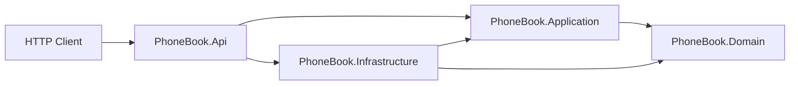
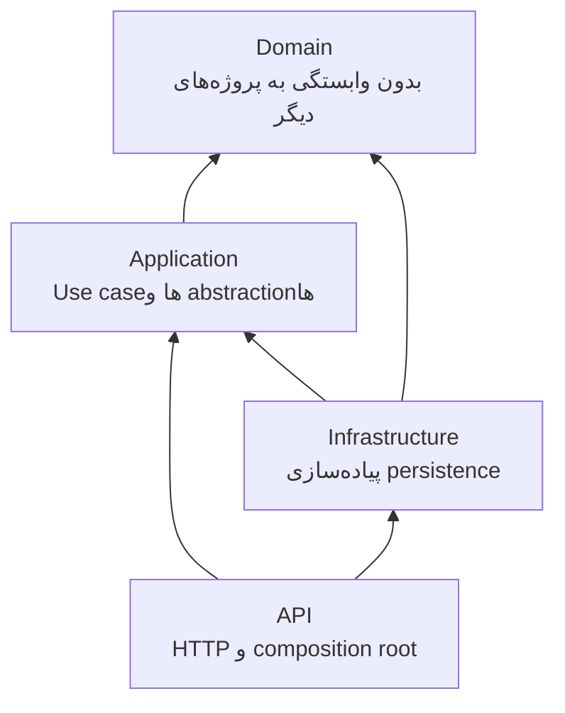
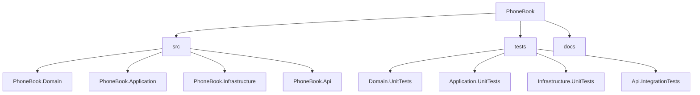
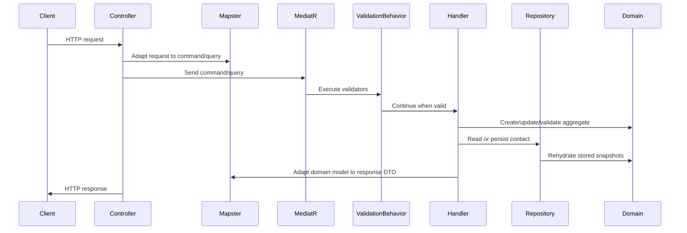
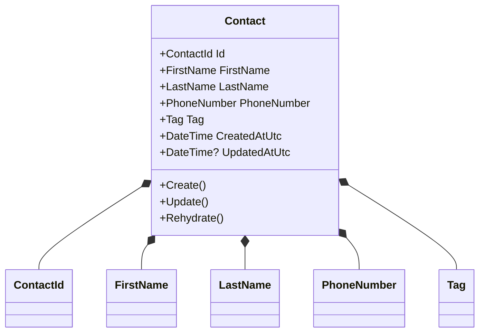
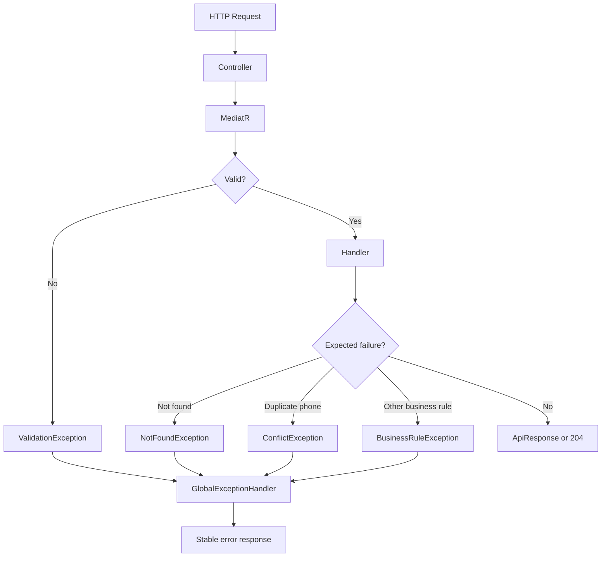

# دفترچه تلفن

## نمای کلی پروژه

PhoneBook یک REST API برای مدیریت مخاطبین است که به‌عنوان تمرین مصاحبه فنی ساخته شده است. این پروژه Clean Architecture، طراحی دامنه‌محور، CQRS، رفتارهای pipeline در MediatR، اعتبارسنجی با FluentValidation، نگاشت آبجکت‌ها با Mapster، یک repository درون‌حافظه‌ای thread-safe، پاسخ‌های API یکپارچه، و تست‌های خودکار در لایه‌های اصلی معماری را نشان می‌دهد.

هدف اصلی پروژه نمایش یک طراحی backend قابل نگهداری است؛ جایی که قوانین کسب‌وکار در لایه Domain، use caseها در لایه Application، جزئیات فنی در Infrastructure، و نگرانی‌های HTTP در پروژه API قرار می‌گیرند.

## قابلیت‌ها

- ایجاد مخاطب.
- به‌روزرسانی مخاطب موجود.
- حذف مخاطب.
- دریافت مخاطب با شناسه.
- دریافت لیست مخاطبین با صفحه‌بندی deterministic.
- فیلتر کردن مخاطبین بر اساس tag همراه با صفحه‌بندی deterministic.
- اعتبارسنجی ورودی‌ها پیش از اجرای handlerها.
- نرمال‌سازی قالب‌های پشتیبانی‌شده شماره موبایل ایران به قالب canonical یعنی `+989xxxxxxxxx`.
- جلوگیری از تکرار شماره موبایل canonical.
- ذخیره زمان ایجاد و به‌روزرسانی بر اساس UTC.
- بازگرداندن قراردادهای پاسخ موفق و خطای یکپارچه.
- ارائه Swagger/OpenAPI در محیط Development.
- اجرا با .NET SDK محلی یا Dockerfile موجود.
- پوشش رفتارها با تست‌های domain، application، infrastructure، concurrency و integration HTTP.

## پشته فناوری

- .NET 9 / ASP.NET Core 9
- ASP.NET Core MVC Controllers
- Clean Architecture
- Domain-Driven Design
- CQRS
- MediatR
- FluentValidation
- Mapster
- Swashbuckle.AspNetCore
- xUnit
- FluentAssertions
- NSubstitute
- Microsoft.AspNetCore.Mvc.Testing
- Coverlet collector
- Repository درون‌حافظه‌ای thread-safe
- Dockerfile برای اجرای containerized

## معماری

راهکار از Clean Architecture پیروی می‌کند. وابستگی‌ها به سمت داخل هستند: API به Application و Infrastructure وابسته است، Infrastructure به abstractionهای Application و Domain وابسته است، Application به Domain وابسته است، و Domain به هیچ پروژه دیگری در solution وابسته نیست.

- **API** مسئول controllerهای HTTP، قراردادهای request/response، Swagger، تبدیل exceptionها به HTTP، و پیکربندی composition root است.
- **Application** مسئول use caseها، commandها، queryها، handlerها، validatorها، پیکربندی mapping، exceptionهای application، pipeline behaviorها و abstractionهای repository است.
- **Domain** مسئول aggregate مخاطب، value objectها، abstractionهای entity و invariantهای کسب‌وکار است.
- **Infrastructure** مسئول پیاده‌سازی درون‌حافظه‌ای abstractionهای persistence در Application است.





## ساختار راهکار

```text
PhoneBook.sln
src/
  PhoneBook.Domain/
    Contacts/
    Abstractions/
  PhoneBook.Application/
    Abstractions/Persistence/
    Behaviors/
    Common/
    Contacts/
  PhoneBook.Infrastructure/
    Persistence/
  PhoneBook.Api/
    Contracts/
    Controllers/
    ExceptionHandling/
    Mappings/
tests/
  PhoneBook.Domain.UnitTests/
  PhoneBook.Application.UnitTests/
  PhoneBook.Infrastructure.UnitTests/
  PhoneBook.Api.IntegrationTests/
docs/
  architecture-decisions.md
```

- **PhoneBook.Domain** برای مدل‌سازی رفتار مخاطب و محافظت از قوانین کسب‌وکار بدون وابستگی به frameworkها وجود دارد.
- **PhoneBook.Application** برای هماهنگ‌سازی use caseها از طریق پیام‌های CQRS، handlerها، validatorها، mapping و قراردادهای persistence وجود دارد.
- **PhoneBook.Infrastructure** برای ارائه پیاده‌سازی in-memory repository پشت abstraction لایه Application وجود دارد.
- **PhoneBook.Api** برای ارائه برنامه از طریق endpointهای REST و پیکربندی runtime وجود دارد.
- **PhoneBook.Domain.UnitTests** رفتار value objectها، aggregate و invariantهای domain را بررسی می‌کند.
- **PhoneBook.Application.UnitTests** validatorها، pipeline behavior و handlerها را بررسی می‌کند.
- **PhoneBook.Infrastructure.UnitTests** رفتار repository، صفحه‌بندی، یکتایی، snapshot isolation و concurrency را بررسی می‌کند.
- **PhoneBook.Api.IntegrationTests** رفتار واقعی HTTP را با `WebApplicationFactory` بررسی می‌کند.



## جریان درخواست

درخواست از طریق API controller وارد می‌شود، با Mapster به command یا query لایه Application تبدیل می‌شود، از طریق MediatR ارسال می‌شود، در pipeline اعتبارسنجی می‌شود، و سپس توسط handler مربوطه پردازش می‌شود. handlerها از abstraction مربوط به repository استفاده می‌کنند، در صورت نیاز objectهای domain را ایجاد یا به‌روزرسانی می‌کنند، و DTO پاسخ را برمی‌گردانند. exceptionهای مورد انتظار توسط global exception handler به پاسخ‌های پایدار API تبدیل می‌شوند.

```text
Controller -> Mapster -> MediatR -> ValidationBehavior -> Handler -> Repository -> Domain -> Response
```



## CQRS

CQRS عملیات نوشتن را از عملیات خواندن جدا می‌کند. این انتخاب باعث می‌شود هر use case کوچک، صریح و قابل تست بماند.

- **Commandها** state را تغییر می‌دهند: `CreateContactCommand`، `UpdateContactCommand` و `DeleteContactCommand`.
- **Queryها** state را می‌خوانند: `GetContactByIdQuery`، `GetContactsQuery` و `GetContactsByTagQuery`.
- **Handlerها** جریان application برای یک command یا query را اجرا می‌کنند و به abstractionهایی مثل `IContactRepository` وابسته هستند.

## طراحی دامنه

`Contact` aggregate root است. این کلاس state مخاطب را در اختیار دارد و مسیرهای کنترل‌شده‌ای برای ایجاد، به‌روزرسانی و rehydrate کردن ارائه می‌کند.

این aggregate از value objectهای زیر استفاده می‌کند:

- `ContactId`
- `FirstName`
- `LastName`
- `PhoneNumber`
- `Tag`

قوانین domain شامل اجباری بودن نام و tag، حداکثر طول متن ۱۰۰ کاراکتر، خالی نبودن شناسه مخاطب، معتبر بودن شماره موبایل ایران، UTC بودن timestampها، و زودتر نبودن زمان به‌روزرسانی از زمان ایجاد است. `PhoneNumber` قالب‌های محلی و بین‌المللی پشتیبانی‌شده را نرمال می‌کند. `Tag` به‌صورت case-insensitive مقایسه می‌شود.



## الگوی Repository

`IContactRepository` در لایه Application قرار دارد، چون use caseهای application مشخص می‌کنند به چه عملیات persistence نیاز دارند. Infrastructure این abstraction را با `InMemoryContactRepository` پیاده‌سازی می‌کند.

repository به‌صورت singleton ثبت شده و dictionaryهای داخلی خود را با یک lock محافظت می‌کند. store مخاطبین و index شماره موبایل canonical در یک مرز synchronization بررسی و تغییر می‌کنند؛ بنابراین یکتایی شماره موبایل درون همین process به‌صورت atomic تضمین می‌شود.

repository snapshotهای immutable ذخیره می‌کند و هنگام خواندن، instanceهای جدید `Contact` را rehydrate می‌کند. این کار جلوی تغییر تصادفی state ذخیره‌شده بدون فراخوانی `UpdateAsync` را می‌گیرد.

## اعتبارسنجی

FluentValidation، commandها و queryهای Application را پیش از اجرای handlerها اعتبارسنجی می‌کند. validatorها از assembly لایه Application کشف می‌شوند و توسط `ValidationBehavior<TRequest, TResponse>` که یک MediatR pipeline behavior است اجرا می‌شوند.

اعتبارسنجی ورودی شامل فیلدهای اجباری، حداکثر طول، شناسه‌های غیرخالی، شماره موبایل معتبر و بازه‌های صفحه‌بندی است. invariantهای کسب‌وکار همچنان در Domain enforce می‌شوند و یکتایی atomic در repository enforce می‌شود، چون باید در همان lock بررسی و نوشته شود.

## نگاشت

Mapster برای نگاشت object-to-object بین قراردادهای API، پیام‌های Application، پاسخ‌های صفحه‌بندی‌شده، objectهای domain و DTOهای پاسخ استفاده می‌شود. قوانین mapping با کلاس‌های `IRegister` پیاده‌سازی شده‌اند:

- `PhoneBook.Application.Common.Mappings.ContactMappingConfig`
- `PhoneBook.Api.Mappings.ApiMappingConfig`

پیکربندی dependency injection در Application، assemblyهای mapping را در `TypeAdapterConfig.GlobalSettings` اسکن می‌کند و کد از سبک مستقیم Mapster استفاده می‌کند:

```csharp
contact.Adapt<ContactResponse>();
```

## مدیریت خطا

API از `GlobalExceptionHandler` برای تبدیل failureهای مورد انتظار به پاسخ‌های HTTP یکپارچه استفاده می‌کند.

- `ValidationException` به `400 Bad Request` همراه با `ValidationApiResponse` تبدیل می‌شود.
- `NotFoundException` به `404 Not Found` تبدیل می‌شود.
- `ConflictException` به `409 Conflict` تبدیل می‌شود.
- `BusinessRuleException` به `422 Unprocessable Entity` تبدیل می‌شود.
- exceptionهای غیرمنتظره log می‌شوند و به `500 Internal Server Error` تبدیل می‌شوند.

پاسخ‌های موفق، به‌جز حذف موفق که `204 No Content` برمی‌گرداند، از `ApiResponse<T>` استفاده می‌کنند. پاسخ‌های خطا از `ApiResponse` یا `ValidationApiResponse` استفاده می‌کنند.



## Dependency Injection

`PhoneBook.Api` نقش composition root را دارد. این پروژه controllerها، Swagger، سرویس‌های Application، سرویس‌های Infrastructure و exception handling را ثبت می‌کند.

ثبت Application شامل MediatR handlerها، FluentValidation validatorها، validation pipeline behavior و پیکربندی Mapster است. ثبت Infrastructure، `IContactRepository` را به `InMemoryContactRepository` وصل می‌کند.

کد به‌جای پیاده‌سازی‌های concrete، abstractionهایی مثل `ISender` و `IContactRepository` را inject می‌کند. این کار handlerها را قابل تست نگه می‌دارد و مانع وابستگی Application به Infrastructure می‌شود.

## صفحه‌بندی

endpointهای لیست، `pageNumber` و `pageSize` را دریافت می‌کنند. اگر query valueها ارسال نشوند، mapping در API مقدارهای پیش‌فرض page `1` و size `20` را اعمال می‌کند. اعتبارسنجی الزام می‌کند page number حداقل `1` باشد و page size بین `1` و `100` قرار بگیرد.

نتایج repository ابتدا بر اساس `CreatedAtUtc` و سپس بر اساس `ContactId` مرتب می‌شوند؛ این کار صفحه‌بندی را deterministic نگه می‌دارد.

## تست‌ها

solution برای هر لایه تست‌های متمرکز دارد:

- **Domain unit tests** رفتار value objectها، ایجاد و به‌روزرسانی `Contact`، auditing، قوانین timestamp و normalization را بررسی می‌کنند.
- **Application unit tests** validatorها، MediatR validation behavior، handlerها، forwarding مربوط به cancellation token، mapping و exceptionهای application را بررسی می‌کنند.
- **Infrastructure unit tests** رفتار CRUD در repository، مدیریت شماره تکراری، snapshot isolation، صفحه‌بندی deterministic، فیلتر tag و concurrency را بررسی می‌کنند.
- **API integration tests** endpointهای HTTP، envelopeهای پاسخ، خطاهای validation، exception handling و integration با host واقعی ASP.NET Core را بررسی می‌کنند.

## اجرای پروژه

پیش‌نیاز: .NET SDK نسخه `9.0.102` یا latest patch سازگار، مطابق `global.json`.

```bash
dotnet restore
dotnet build
dotnet run --project src/PhoneBook.Api
dotnet test
```

Swagger در مسیر `/swagger` و فقط در محیط Development در دسترس است.

Dockerfile موجود نیز می‌تواند API را build و اجرا کند:

```bash
docker build -t phonebook-api .
docker run --rm -p 8080:8080 phonebook-api
```

## تصمیم‌های طراحی

- **Clean Architecture:** قوانین کسب‌وکار را از جزئیات HTTP و persistence مستقل نگه می‌دارد.
- **DDD:** رفتار مخاطب را با aggregate root و value objectها مدل می‌کند، نه با منطق پراکنده روی primitiveها.
- **CQRS:** use caseهای خواندن و نوشتن را صریح و مستقل از هم قابل تست می‌کند.
- **MediatR:** dispatch کردن command/queryها را متمرکز می‌کند و pipeline behaviorهایی مثل validation را ممکن می‌سازد.
- **FluentValidation:** اعتبارسنجی ورودی را declarative و جدا از handlerها نگه می‌دارد.
- **Mapster:** mapping سبک و صریح با پیکربندی `IRegister` و مصرف `Adapt<T>()` فراهم می‌کند.
- **In-memory repository:** نیازهای محدوده مصاحبه را بدون راه‌اندازی دیتابیس پوشش می‌دهد.
- **Repository abstraction در Application:** اجازه می‌دهد use caseها نیاز persistence خود را تعریف کنند و Infrastructure فقط پیاده‌سازی را فراهم کند.
- **Global exception handler:** controllerها را روی orchestration HTTP متمرکز نگه می‌دارد و قرارداد خطا را مرکزی می‌کند.
- **خواندن snapshot-based از repository:** جلوی mutation تصادفی state ذخیره‌شده را می‌گیرد.
- **یکتایی atomic شماره موبایل:** از ثبت شماره موبایل canonical تکراری داخل process جلوگیری می‌کند.

## بهبودهای آینده

برای آماده‌سازی production می‌توان موارد زیر را اضافه کرد:

- persistence با EF Core.
- PostgreSQL همراه با migration و unique constraint در سطح دیتابیس.
- Authentication.
- Authorization policyها.
- Docker Compose یا پیکربندی deployment آماده برای orchestration.
- Redis یا cache توزیع‌شده دیگر.
- Structured logging.
- tracing و metrics با OpenTelemetry.
- Health checks.
- مثال‌ها و metadata کامل‌تر برای Swagger.
- Background jobs.
- Rate limiting.
- Cursor-based pagination برای datasetهای بزرگ‌تر.
- Audit trail پایدار.
- گزارش coverage در CI و quality gateها.

## Trade-offs

این پروژه عمداً persistence را درون حافظه نگه می‌دارد تا تمرکز روی معماری و رفتار use caseها بماند. داده‌ها process-local هستند و با restart برنامه از بین می‌روند. repository داخل یک process thread-safe است، اما distributed consistency فراهم نمی‌کند.

Authentication، authorization، storage پایدار، caching، observability و orchestration برای deployment عمداً محدود یا حذف شده‌اند، چون خارج از محدوده فعلی تمرین مصاحبه هستند. طراحی فعلی برای این concernها extension point واضح باقی می‌گذارد، بدون اینکه آن‌ها را به Domain یا Application couple کند.

