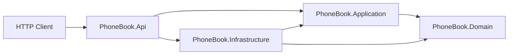
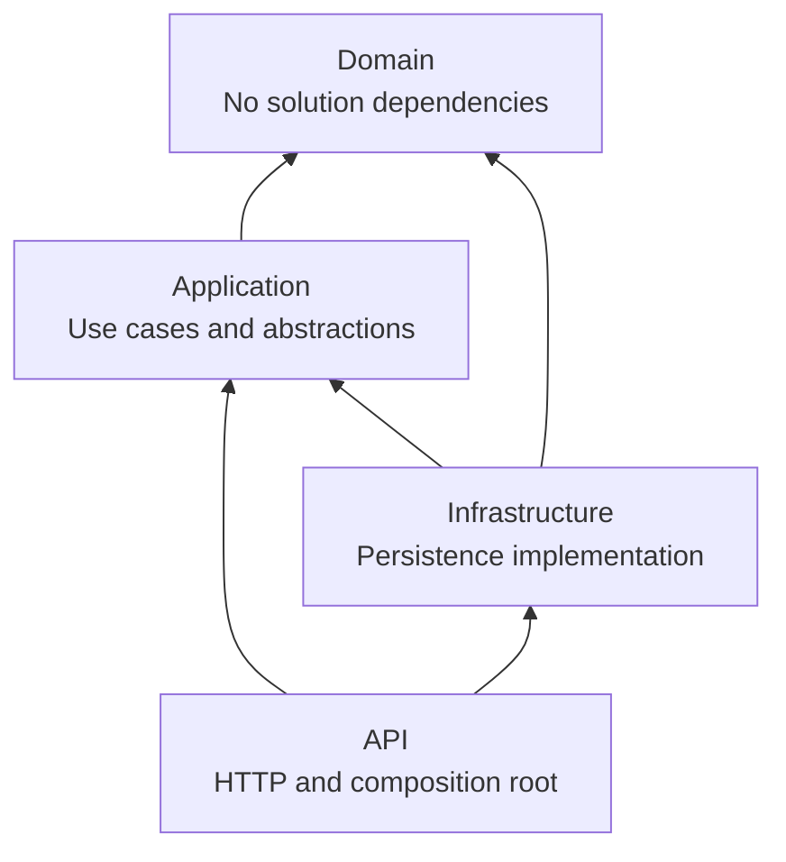
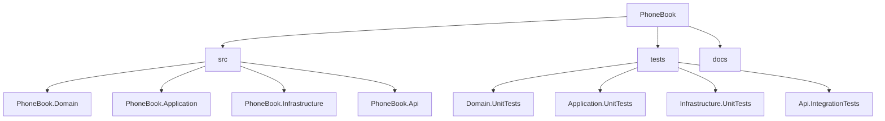
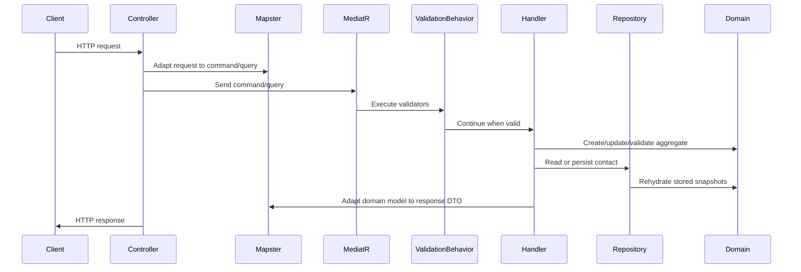
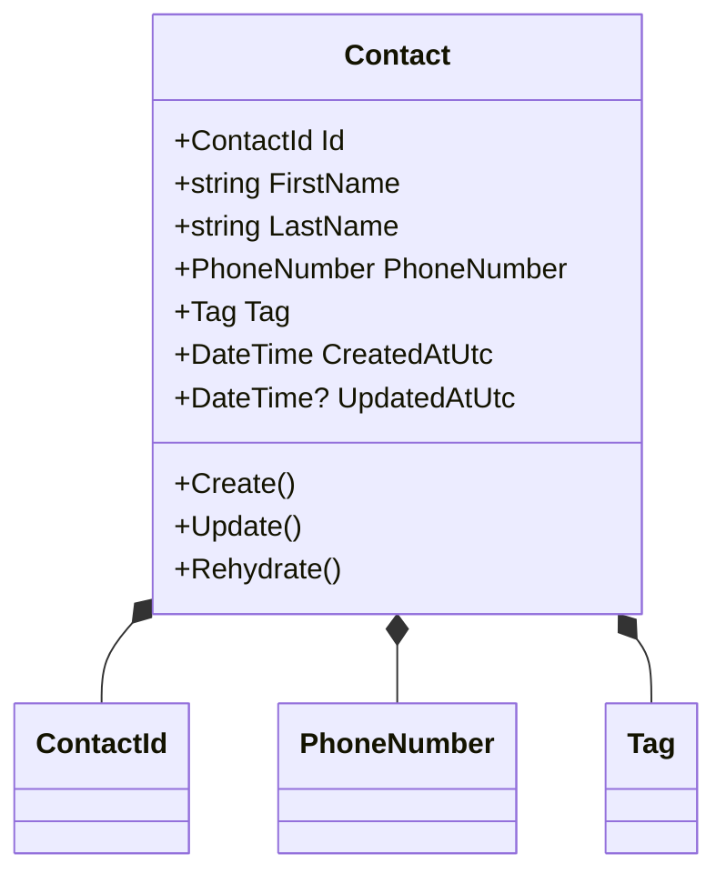
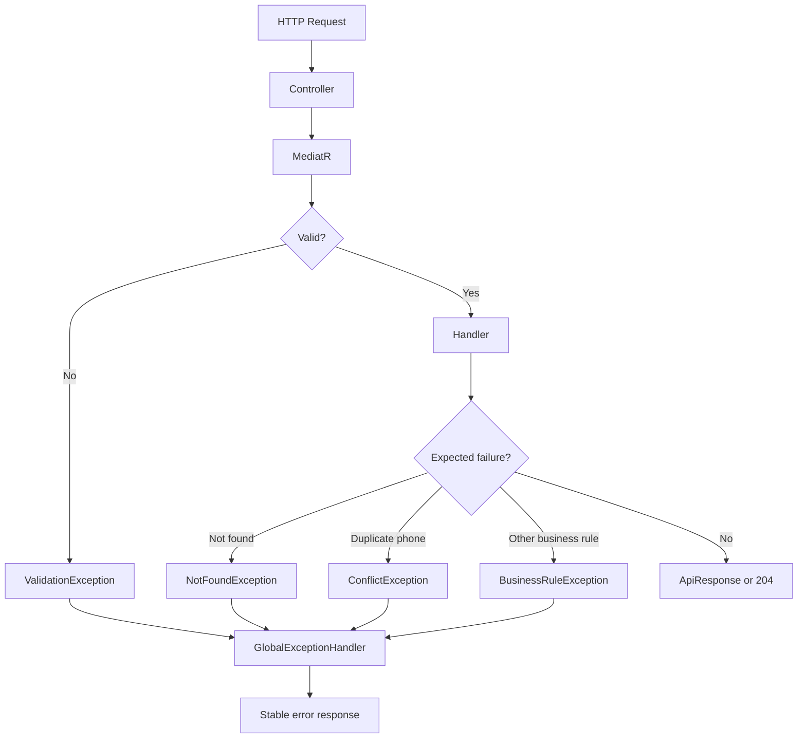

# PhoneBook

## Project Overview

PhoneBook is a REST API for managing contacts, built as a technical interview assignment. The project demonstrates Clean Architecture, Domain-Driven Design, CQRS, MediatR pipeline behaviors, FluentValidation, Mapster-based object mapping, a thread-safe in-memory repository, consistent API responses, and automated tests across the main architectural layers.

The main goal is to show a maintainable backend design where business rules live in the Domain layer, use cases live in the Application layer, technical details live in Infrastructure, and HTTP concerns remain in the API project.

## Features

- Create a contact.
- Update an existing contact.
- Delete a contact.
- Get a contact by ID.
- List contacts with deterministic pagination.
- Filter contacts by tag with deterministic pagination.
- Validate contact input before handlers execute.
- Normalize supported Iranian mobile phone number formats to canonical `+989xxxxxxxxx` format.
- Enforce unique canonical phone numbers.
- Store creation and update timestamps in UTC.
- Return consistent success and error response contracts.
- Expose Swagger/OpenAPI in the Development environment.
- Run with the local .NET SDK or the included Dockerfile.
- Verify behavior through domain, application, infrastructure, concurrency, and HTTP integration tests.

## Technology Stack

- .NET 9 / ASP.NET Core 9
- ASP.NET Core MVC Controllers
- Clean Architecture
- Domain-Driven Design
- CQRS
- MediatR
- FluentValidation
- Mapster
- Swashbuckle.AspNetCore
- xUnit
- FluentAssertions
- NSubstitute
- Microsoft.AspNetCore.Mvc.Testing
- Coverlet collector
- Thread-safe in-memory repository
- Dockerfile for containerized execution

## Architecture

The solution follows Clean Architecture. Dependencies point inward: API depends on Application and Infrastructure, Infrastructure depends on Application abstractions and Domain, Application depends on Domain, and Domain depends on no other solution project.

- **API** owns HTTP controllers, request/response contracts, Swagger, exception-to-HTTP mapping, and composition root configuration.
- **Application** owns use cases, commands, queries, handlers, validators, mapping configuration, application exceptions, pipeline behaviors, and repository abstractions.
- **Domain** owns the `Contact` aggregate, selected value objects, entity abstractions, and business invariants.
- **Infrastructure** owns the in-memory implementation of application persistence abstractions.





## Solution Structure

```text
PhoneBook.sln
src/
  PhoneBook.Domain/
    Contacts/
    Abstractions/
  PhoneBook.Application/
    Abstractions/Persistence/
    Behaviors/
    Common/
    Contacts/
  PhoneBook.Infrastructure/
    Persistence/
  PhoneBook.Api/
    Contracts/
    Controllers/
    ExceptionHandling/
    Mappings/
tests/
  PhoneBook.Domain.UnitTests/
  PhoneBook.Application.UnitTests/
  PhoneBook.Infrastructure.UnitTests/
  PhoneBook.Api.IntegrationTests/
docs/
  architecture-decisions.md
```

- **PhoneBook.Domain** exists to model contact behavior and protect business rules without framework dependencies.
- **PhoneBook.Application** exists to coordinate use cases through CQRS messages, handlers, validators, mapping, and persistence contracts.
- **PhoneBook.Infrastructure** exists to provide the in-memory repository implementation behind the Application abstraction.
- **PhoneBook.Api** exists to expose the application through REST endpoints and configure the runtime.
- **PhoneBook.Domain.UnitTests** verifies value objects, aggregate behavior, primitive name validation, and domain invariants.
- **PhoneBook.Application.UnitTests** verifies validators, pipeline behavior, and handlers.
- **PhoneBook.Infrastructure.UnitTests** verifies repository behavior, pagination, uniqueness, snapshot isolation, and concurrency.
- **PhoneBook.Api.IntegrationTests** verifies real HTTP behavior through `WebApplicationFactory`.



## Request Flow

A request enters through an API controller, is mapped to an Application command or query with Mapster, is sent through MediatR, is validated by the validation pipeline, and is handled by a use-case handler. Handlers use the repository abstraction, create or update domain objects when needed, and return response DTOs. Expected exceptions are converted to stable API responses by the global exception handler.

```text
Controller -> Mapster -> MediatR -> ValidationBehavior -> Handler -> Repository -> Domain -> Response
```



## CQRS

CQRS separates write operations from read operations. This keeps each use case small, explicit, and easy to test.

- **Commands** change state: `CreateContactCommand`, `UpdateContactCommand`, and `DeleteContactCommand`.
- **Queries** read state: `GetContactByIdQuery`, `GetContactsQuery`, and `GetContactsByTagQuery`.
- **Handlers** contain the application flow for one command or query and depend on abstractions such as `IContactRepository`.

## Domain Design

`Contact` is the aggregate root. It owns the contact state and exposes controlled creation, update, and rehydration paths.

The aggregate uses these value objects:

- `ContactId`
- `PhoneNumber`
- `Tag`

`FirstName` and `LastName` are primitive `string` properties. Their validation is enforced inside the `Contact` aggregate: values are required, trimmed, rejected when empty or whitespace-only, and limited to 100 characters.

Domain rules include required names, required tag, maximum text length of 100 characters, non-empty contact IDs, valid Iranian mobile phone numbers, UTC timestamps, and update timestamps that cannot be earlier than creation timestamps. `PhoneNumber` normalizes supported local and international formats. `Tag` compares case-insensitively.



## Repository Pattern

`IContactRepository` belongs to the Application layer because application use cases define the persistence operations they need. Infrastructure implements that abstraction with `InMemoryContactRepository`.

The repository is registered as a singleton and protects its internal dictionaries with a single lock. The contact store and canonical phone-number index are checked and mutated within the same synchronization boundary, so phone-number uniqueness is atomic inside the process.

The repository stores immutable snapshots and rehydrates new `Contact` instances on reads. This prevents accidental mutation of persisted state without calling `UpdateAsync`.

## Validation

FluentValidation validates Application commands and queries before handlers run. Validators are discovered from the Application assembly and executed by `ValidationBehavior<TRequest, TResponse>`, a MediatR pipeline behavior.

Input validation covers required fields, maximum lengths, non-empty IDs, valid phone numbers, and pagination ranges. Business invariants are still enforced in the Domain layer, and atomic uniqueness is enforced in the repository because it must be checked and written under one lock.

## Mapping

Mapster is used for object-to-object mappings between API contracts, Application messages, paged responses, domain objects, and response DTOs. Mapping rules are implemented with `IRegister` classes:

- `PhoneBook.Application.Common.Mappings.ContactMappingConfig`
- `PhoneBook.Api.Mappings.ApiMappingConfig`

The Application dependency injection configuration scans mapping assemblies into `TypeAdapterConfig.GlobalSettings`, and code uses the direct Mapster style:

```csharp
contact.Adapt<ContactResponse>();
```

## Exception Handling

The API uses `GlobalExceptionHandler` to convert expected failures into consistent HTTP responses.

- `ValidationException` becomes `400 Bad Request` with `ValidationApiResponse`.
- `NotFoundException` becomes `404 Not Found`.
- `ConflictException` becomes `409 Conflict`.
- `BusinessRuleException` becomes `422 Unprocessable Entity`.
- Unexpected exceptions are logged and become `500 Internal Server Error`.

Success responses use `ApiResponse<T>` except for successful deletes, which return `204 No Content`. Error responses use `ApiResponse` or `ValidationApiResponse`.



## Dependency Injection

`PhoneBook.Api` is the composition root. It registers controllers, Swagger, Application services, Infrastructure services, and exception handling.

Application registration adds MediatR handlers, FluentValidation validators, the validation pipeline behavior, and Mapster configuration. Infrastructure registration maps `IContactRepository` to `InMemoryContactRepository`.

The code injects abstractions such as `ISender` and `IContactRepository` instead of concrete implementations. This keeps handlers testable and prevents Application from depending on Infrastructure.

## Pagination

List endpoints accept `pageNumber` and `pageSize`. If query values are omitted, API mapping applies defaults of page `1` and size `20`. Validation requires page number to be at least `1` and page size to be between `1` and `100`.

Repository results are ordered by `CreatedAtUtc` and then by `ContactId`, which keeps pagination deterministic.

## Testing

The solution has focused tests for each layer:

- **Domain unit tests** verify value objects, primitive name validation inside `Contact`, `Contact` creation, updates, auditing, timestamp rules, and normalization.
- **Application unit tests** verify validators, MediatR validation behavior, handlers, cancellation token forwarding, mapping, and application exceptions.
- **Infrastructure unit tests** verify repository CRUD behavior, duplicate phone handling, snapshot isolation, deterministic pagination, tag filtering, and concurrency.
- **API integration tests** verify HTTP endpoints, response envelopes, validation errors, exception handling, and integration with the real ASP.NET Core host.

## Running the Project

Prerequisite: .NET SDK `9.0.102` or a compatible latest patch version, as defined in `global.json`.

```bash
dotnet restore
dotnet build
dotnet run --project src/PhoneBook.Api
dotnet test
```

Swagger is available at `/swagger` when the application runs in the Development environment.

The included Dockerfile can also build and run the API:

```bash
docker build -t phonebook-api .
docker run --rm -p 8080:8080 phonebook-api
```

## Design Decisions

- **Clean Architecture:** keeps business rules independent from HTTP and persistence details.
- **DDD:** models contact behavior through an aggregate root and value objects where they carry dedicated domain behavior, while primitive names are validated inside the aggregate.
- **CQRS:** keeps read and write use cases explicit and independently testable.
- **MediatR:** centralizes command/query dispatch and enables pipeline behaviors such as validation.
- **FluentValidation:** keeps input validation declarative and separate from handlers.
- **Mapster:** provides lightweight, explicit object mapping with `IRegister` configuration and `Adapt<T>()` usage.
- **In-memory repository:** satisfies the interview scope without adding database setup.
- **Application-owned repository abstraction:** lets use cases define their persistence needs while Infrastructure supplies the implementation.
- **Global exception handler:** keeps controllers focused on HTTP orchestration and centralizes error contracts.
- **Snapshot-based repository reads:** prevents accidental mutation of stored state.
- **Atomic phone uniqueness:** prevents duplicate canonical phone numbers inside the process.

## Future Improvements

Production-ready evolution could include:

- EF Core persistence.
- PostgreSQL with migrations and database-level unique constraints.
- Authentication.
- Authorization policies.
- Docker Compose or orchestration-ready deployment configuration.
- Redis or another distributed cache.
- Structured logging.
- OpenTelemetry tracing and metrics.
- Health checks.
- More detailed Swagger examples and API metadata.
- Background jobs.
- Rate limiting.
- Cursor-based pagination for larger datasets.
- Persistent audit trail.
- CI coverage reporting and quality gates.

## Trade-offs

This project intentionally keeps persistence in memory to stay focused on architecture and use-case behavior. Data is process-local and lost on restart. The repository provides thread safety inside one application process, not distributed consistency.

Authentication, authorization, durable storage, caching, observability, and deployment orchestration are intentionally limited or absent because they are outside the current interview task scope. The design leaves clear extension points for those concerns without coupling them to the Domain or Application layers.
